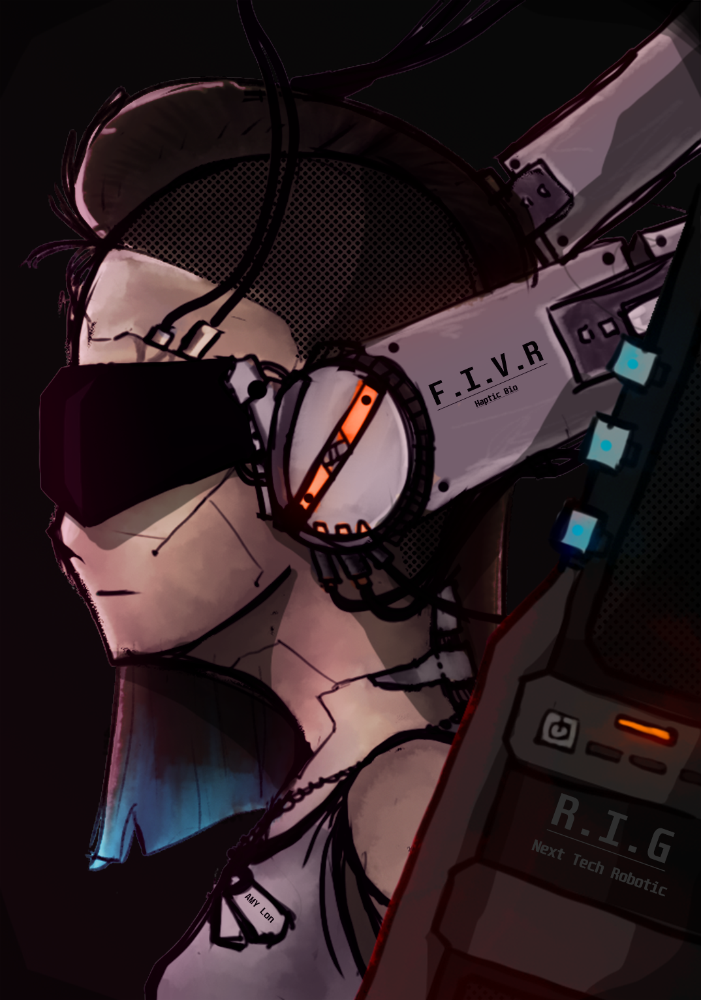

## Hello there 👋

### Introduction:  
I am a creative individual with a background in self-taught digital art and illustration, in addition to working on a degree in computer science and a minor in data science,  and I love building things.   
. 

some of my work is as shown above. but here in this github place i do much more then art. i am keenly interested in intellegent systems and wisdom based systems coding for creative use and designing extensions to the human expiernce to allow better productivity. 

In other things, I also have a keen interest in video games, both technically and design, with again a focus on intelligent systems 

As with most of my projects, they are done in iterations separated from one another, and then brought together to interact as modules. forcing a modular design and reusability within each iteration. Though I have yet to finish many of them, I do have a number of working prototypes and programs that I use to further research and design the next iterations.

## Active Learning:

I'm currently learning deep learning techniques and the pipeline from maths to prototype training and deployment of custom models.

I'm also currently engaged in learning networking for games, among other game-related aspects. 

## Active Projects:

_Mirror Image_: is a cooperative card game that is a first-person shooter survival rogue-like game. It emphasizes creating dynamic, fun, intelligent content that is both suspenseful and challenging. 

_GAVIN_: An AI model built from the ground up from scratch.
## Working Programs 

_GAVIN M1_: A GPT wrapper experimenting with components related to agent-based application development. It also experiments with model prompt engineering and context relevance. has a localized database and encryption.

_toDo list app_: a school project that turned out to be quite useful in learning techniques applied in the GPT wrapper.

_plethora of standalone game systems_: from inventory systems, card mechanics builders, first-person controls, and statemachine-based decision systems. 

## Goals:

My main goal is to build something memorable and generalizable. I am starting with games because I can apply the practical skills here while staying motivated by seeing clear progress. 

## Languages I have worked with:
_* have a indepth of knowledge_
- Python*
- java*
- C#*
- CSS
- JS
- HTML
- R
- C
- C++

<!--
**Leviathan-CE/Leviathan-CE** is a ✨ _special_ ✨ repository because its `README.md` (this file) appears on your GitHub profile.

Here are some ideas to get you started:

- 🔭 I’m currently working on ...
- 🌱 I’m currently learning ...
- 👯 I’m looking to collaborate on ...
- 🤔 I’m looking for help with ...
- 💬 Ask me about ...
- 📫 How to reach me: ...
- 😄 Pronouns: ...
- ⚡ Fun fact: ...
-->
